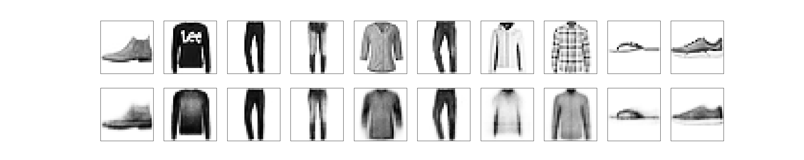

## SIPLab MNIST Autoencoder Github Template


This project demonstrates how to train an autoencoder [1,2] on the MNIST dataset using PyTorch, a widely used deep learning framework. This repository serves as an instructive guide for building a machine learning project. It includes best practices for organizing code, managing environments, and utilizing version control through branching strategies. 




## Branches
Using multiple branches is key for managing your code and can help minimize bugs in outward-facing code. In this repo, we have the following two branches:

- `main`: Contains the stable version of the code
- `new_feature`: For developing new model architectures and testing new features

## Installation

Follow these straightforward steps to set up the project:

```bash
git clone https://github.com/yenhochen/siplab-github-template.git
cd siplab-github-template
conda env create -f environment.yml
conda activate mnist-autoencoder
```

## Managing Conda Environment

A reproducible Conda environment is essential for ensuring reliability and consistency in your projects. It allows you and your collaborators to recreate the same development setup easily, reducing the risk of discrepancies from different package versions and dependencies. Below are the steps to create and export a Conda environment.

1. **Creating the environment from an yaml file:** We recommend exporting conda environments to an `environment.yml` file, as it’s straightforward and includes package versions.

```bash
conda env create -f environment.yml
conda activate mnist-autoencoder
```

2. **Exporting current conda environment:** This command generates the `environment.yml` file while removing the `prefix:` line for anonymity.

```bash
conda env export | grep -v "^prefix: " > environment.yml\
```

## Dataset
In this repo, datasets can be downloaded using code in `src/load_datasets.py` and are stored in `data/`. When running the provided scripts, the dataset will be automatically downloaded to the `data_dir` specified in the configuration file. It is generally best not to store datasets directly on GitHub. Instead, include code to generate the data or provide clear instructions for obtaining the relevant datasets.

## Configuration File

This project uses a YAML configuration file to manage various parameters related to data, training, and model architecture. Configuration files are stored in the `configs` directory. Below is an example of a typical configuration file (`config.yml`) used in this project:

```yaml
# Sets the random seed for reproducibility. This ensures that the results are consistent across different runs.
seed: 0 

# data_args
dataset: "fmnist"   # Specifies the dataset to be used. Must be "fmnist" (Fashion MNIST) or "mnist" (MNIST).
data_dir: "./data"  # Indicates the directory where the dataset is stored.

# train args:
device: "cuda:0" 
batch_size: 512 
learning_rate: 0.01 
weight_decay: 0.00 
train_epochs: 10
sched_gamma: 0.999  # Defines the decay factor for the learning rate scheduler.

# model params
img_height: 28
img_width: 28
hidden_dim: 128    # Sets the number of hidden units in the autoencoder.
latent_dim: 32     # Defines the size of the latent space representation.
n_layers: 3        # Specifies the number of layers in the model.
layernorm: false   # A boolean indicating whether to apply layer normalization.

# plotting
nrows: 5           # Sets the number of rows for plotting figures.
ncols: 5           # Sets the number of columns for plotting figures.
```


## Experiments/Scripts
We provide training and plotting scripts in the `scripts` directory, which require a single argument `--config` that specifies the location of the configuration file. By running these commands from the `root` directory, you can generate visualizations and train the autoencoder model on the MNIST dataset.

1. Plot Samples from Dataloader:
   
   ```bash
   python scripts/plot_data_samples.py --config configs/config.yml
   ```
   
3. Train model:
   
   ```bash
   python scripts/train_model.py --config configs/config.yml
   ```


## Checkpoints

Some projects may require saving important checkpoints for reproducibility. Similar to datasets, checkpoints should generally not be stored on GitHub; instead, they should be kept in an external database. Additionally, repositories should include a mechanism for easily retrieving results from checkpointed models.


## References

[1]: Goodfellow, Ian, et al. "Deep Learning". _MIT Press_, 2016.

[2]: Murphy, Kevin P. "Probabilistic machine learning: an introduction". _MIT press_, 2022.
